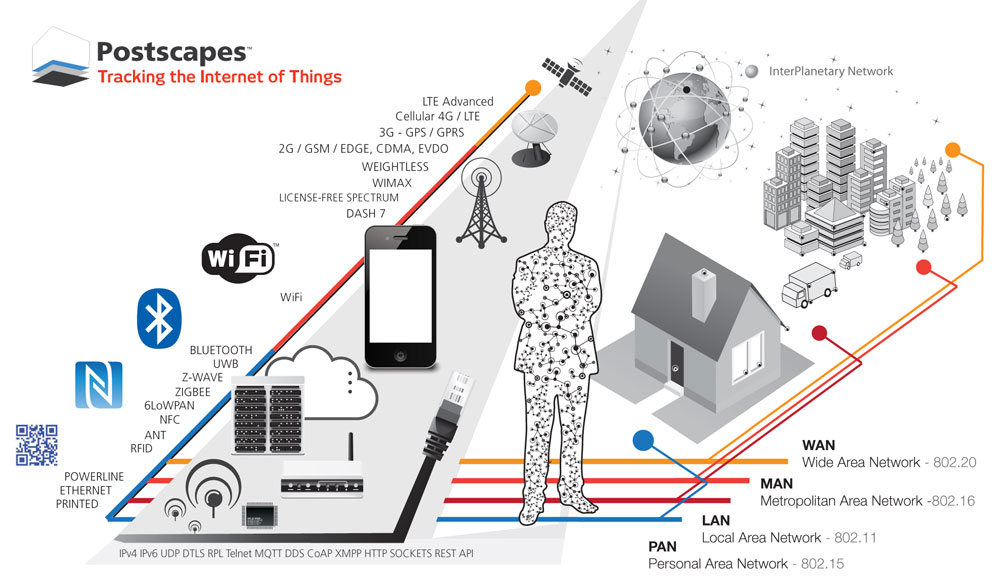
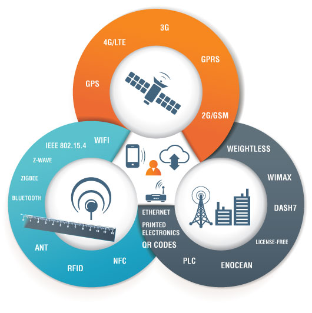
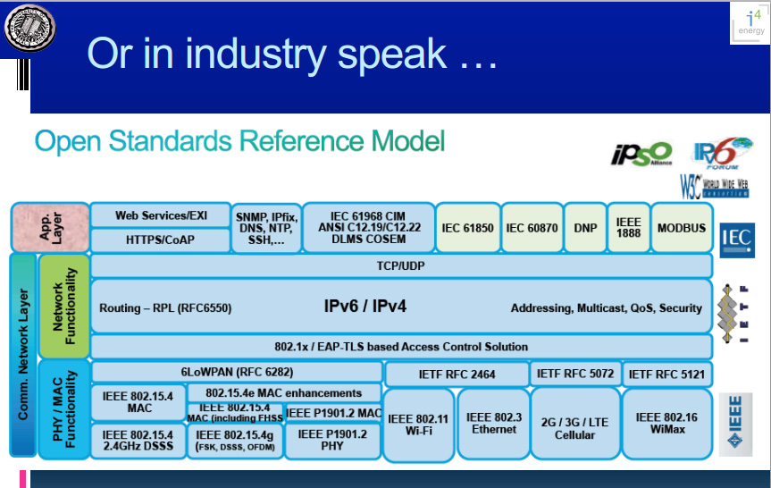
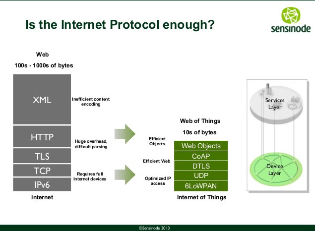
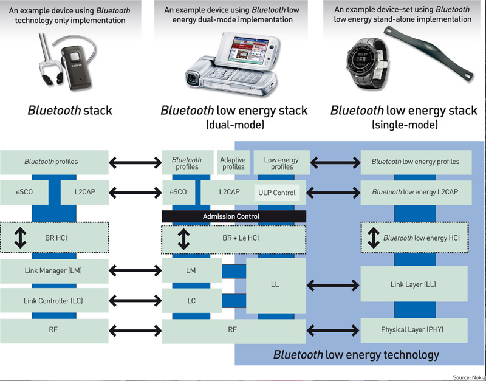

# Summary of Internet of Things (IoT) Technology
The term Internet of Things (IoT) describes several technologies and research disciplines that enable the Internet to reach out into the real world of physical objects. Technologies like RFID, short-range wireless communications, real-time localization, and sensor networks are becoming increasingly pervasive, making the IoT a reality. This information is taken largely from [Postscapes.com IoT page](http://postscapes.com/internet-of-things-technologies) along with following the links from that page.

# Communication

[Postscapes Summary](http://postscapes.com/internet-of-things-technologies) highlights the following communication technologies:

## Satellite
--------------------
* Cellular - 4G/LTE, 3G/GRPS, 2G/GSM-EDGE,CDMA,EVDO
* GPS - Global Positioning System
* GSM - (Global System for Mobile communications) is an open, digital cellular technology used for transmitting mobile voice and data services. 

## Tower 
--------------------
* Weightless - [Weightless](http://www.weightless.org/) is a proposed proprietary open wireless technology standard for exchanging data between a base station and thousands of machines around it using White space (wavelength radio transmissions in unoccupied TV transmission channels) with high levels of security.
    * **Range**: Up to 10km
* WIMAX - [WiMAX](https://en.wikipedia.org/wiki/WiMAX) (Worldwide Interoperability for Microwave Access) is a wireless communications standard designed to provide 30 to 40 megabit-per-second data rates,[1] with the 2011 update providing up to 1 Gbit/s[1] for fixed stations. The name "WiMAX" was created by the WiMAX Forum, which was formed in June 2001 to promote conformity and interoperability of the standard. The forum describes WiMAX as "a standards-based technology enabling the delivery of last mile wireless broadband access as an alternative to cable and DSL".
    * **Range**: Up to 50km
* DASH 7 - [DASH7](http://en.wikipedia.org/wiki/DASH7) is an open source RFID-standard for wireless sensor networking, which operates in the 433 MHz unlicensed ISM band/SRD band. DASH7 provides multi-year battery life, range of up to 2 km, indoor location with 1 meter accuracy, low latency for connecting with moving things, a very small open source protocol stack, AES 128-bit shared key encryption support, and data transfer of up to 200 kbit/s. DASH7 is the name of the technology promoted by the non-profit consortium called the [DASH7 Alliance](http://en.wikipedia.org/wiki/DASH7_Alliance).
    * **Range**: up to 2km

## Wireless Access Point
---------------------
* WiFi - Wi-Fi is a technology that allows an electronic device to exchange data wirelessly (using radio waves) over a computer network, including high-speed Internet connections. The Wi-Fi Alliance defines Wi-Fi as any "wireless local area network" (WLAN) products that are based on the Institute of Electrical and Electronics Engineers' (IEEE) 802.11a/b/g/n/af
    * **Range**: Common range is up to 100m but can be extended.
* Bluetooth - [Bluetooth](http://www.bluetooth.com/Pages/Bluetooth-Home.aspx) is a wireless technology standard for exchanging data over short distances (using short-wavelength radio transmissions in the ISM band from 2400–2480 MHz) from fixed and mobile devices, creating personal area networks (PANs) with high levels of security.
    * **Range**: 1-100m
* Bluetooh Low Energy - [Bluetooth low energy wireless](http://www.bluetooth.com/Pages/low-energy-tech-info.aspx), thanks to its innovative design, consumes only a fraction of the power of Classic Bluetooth radios. Bluetooth low energy technology extends the use of Bluetooth wireless technology to devices that are powered by small, coin-cell batteries such as watches and toys. Other devices such as sports & fitness, health care, human interface (HIDs) like keyboards and mice and entertainment devices will also be enhanced by this version of the technology. In many cases, it makes it possible to operate these devices for more than a year without recharging.
As with previous versions of the specification, the range of the Bluetooth v4.0 radio may be optimized according to application. The majority of Bluetooth devices on the market today include the basic 30 foot, or 10 meter, range of the Classic Bluetooth radio, but there is no limit imposed by the Specification. With Bluetooth v4.0, manufacturers may choose to optimize range to 200 feet and beyond, particularly for in-home sensor applications where longer range is a necessity.
Bluetooth low energy wireless technology, the hallmark feature of the v4.0 Bluetooth Core Specification, features:
    * Ultra-low peak, average and idle mode power consumption
    * Ability to run for years on standard coin-cell batteries
    * Low cost
    * Multi-vendor interoperability
    * Enhanced range
    * **Range**: 1-100m
* RFID - [ISO RFID Complete list of standards](http://rfid.net/basics/186-iso-rfid-standards-a-complete-list) A radio-frequency identification system uses tags, or labels attached to the objects to be identified. Two-way radio transmitter-receivers called interrogators or readers send a signal to the tag and read its response. The readers generally transmit their observations to a computer system running RFID software or RFID middleware.
RFID tags can be either passive, active or battery assisted passive. An active tag has an on-board battery and periodically transmits its ID signal. A battery assisted passive (BAP) has a small battery on board and is activated when in the presence of a RFID reader.
    * **Range**: 10cm to 200m
* NFC - [Near field communication](http://en.wikipedia.org/wiki/Near_field_communication) is a set of short-range wireless technologies, typically requiring a distance of 10 cm or less. NFC operates at 13.56 MHz on ISO/IEC 18000-3 air interface and at rates ranging from 106 kbit/s to 424 kbit/s. 
NFC always involves an initiator and a target; the initiator actively generates an RF field that can power a passive target. This enables NFC targets to take very simple form factors such as tags, stickers, key fobs, or cards that do not require batteries. NFC peer-to-peer communication is possible, provided both devices are powered
    * **Range**: < 0.2 m
* [EnOcean](http://www.enocean-alliance.org/en/home/) - ISO/IEC 14543-3-10. EnOcean technology is an energy harvesting wireless technology used primarily in building automation systems; but is also applied to other applications in industry, transportation, logistics and smart homes. 

	Modules based on EnOcean technology combine micro energy converters with ultra low power electronics and enable wireless communications between batteryless wireless sensors, switches, controllers and gateways.
	* **Range**: 300m Outdoor, 30m Indoors
* [X-10](http://en.wikipedia.org/wiki/X10_(industry_standard)) - is a protocol for communication among electronic devices used for home automation (domotics). It primarily uses power line wiring for signaling and control, where the signals involve brief radio frequency bursts representing digital information. A wireless radio based protocol transport is also defined.
* Z-Wave - [Z-Wave protocol](http://www.z-wavealliance.org/technology) is an interoperable wireless RF-based communications technology designed specifically for control, monitoring and status reading applications in residential and light commercial environments. Mature, proven and broadly deployed (25 million products sold worldwide), Z-Wave is by far the world market leader in wireless control, bringing affordable, reliable and easy-to-use 'smart' products to many millions of people in every aspect of daily life.
* Zigbee - [ZigBee] (https://www.zigbee.org/Standards/Overview.aspx) After 10 years and millions of implementations every year, ZigBee standards prove you can rely on the widest variety of smart and easy-to-use products for just about anywhere you work, live or play. Our innovative standards are designed to let product manufacturers help their customers create their own Internet of Things and M2M wireless sensor networks to gain greater control of, and even improve, everyday activities.

	ZigBee lets you easily and cost-effectively add intelligent new features that improve the efficiency, safety, security, reliability and convenience of your products. You can help your customers save both energy and money, or give them the tools they need to gain control of their homes. It's even possible to help people maintain their independence and allow them to closely monitor their health and fitness. 
        
## Wired
--------------------
* Ethernet -  is a family of computer networking technologies for local area networks (LANs) [IEEE 802.3](http://standards.ieee.org/about/get/802/802.3.html).
*  PLC / Powerline - [Power-line communication(PLC)](http://en.wikipedia.org/wiki/Power_line_communication) carries data on a conductor that is also used simultaneously for AC electric power transmission or electric power distribution to consumers. It is also known as power-line carrier, power-line digital subscriber line (PDSL), mains communication, power-line telecommunications, or power-line networking (PLN).

## Classes of Networks
* Wide Area Network (WAN) - 802.20
* Metropolitan Area Network (MAN) - 802.16
* Local Area Network (LAN) - 802.11
* Personal Area Network (PAN) - 802.15
	*  IEEE 802.15.4 is a standard which specifies the physical layer and media access control for low-rate wireless personal area networks (LR-WPANs). It is maintained by the IEEE 802.15 working group. It is the basis for the ZigBee, ISA100.11a, WirelessHART, and MiWi specifications, each of which further extends the standard by developing the upper layers which are not defined in IEEE 802.15.4. Alternatively, it can be used with 6LoWPAN and standard Internet protocols to build a wireless embedded Internet.

# Backbone Protocols
* IPv4 and IPv6 - [Internet Protocol version 6 (IPv6)](http://en.wikipedia.org/wiki/IPv6) is the latest revision of the Internet Protocol (IP), the communications protocol that provides an identification and location system for computers on networks and routes traffic across the Internet.
Every device on the Internet must be assigned an IP address in order to communicate with other devices. With the ever-increasing number of new devices being connected to the Internet, the need arose for more addresses than IPv4 is able to accommodate. IPv6 uses a 128-bit address, allowing approximately 3.4×10^38 addresses, or more than 7.9×10^28 times as many as IPv4's 32-bit addresses.
* 6LoWPAN - IPv6 over Low power Wireless Personal Area Networks. The 6LoWPAN group has defined encapsulation and header compression mechanisms that allow IPv6 packets to be sent to and received from over IEEE 802.15.4 based networks.
    * [6LoWPAN Background](http://en.wikipedia.org/wiki/6LoWPAN)
    * [Transmission of IPv6 Packets over IEEE 802.15.4 Networks](http://tools.ietf.org/html/rfc4944)
    * [Compression Format for IPv6 Datagrams over IEEE 802.15.4-Based Networks](http://tools.ietf.org/html/rfc6282)
    * [Neighbor Discovery Optimization for IPv6 over Low-Power Wireless Personal Area Networks (6LoWPANs)](http://tools.ietf.org/html/rfc6775)
    * [IEEE 802.15.4 physical layer and media access control for low-rate wireless personal area networks (LR-WPANs).](http://en.wikipedia.org/wiki/IEEE_802.15.4)
    * [How to setup a 6LoWPAN network](http://www.embedded.com/electronics-blogs/embedded-cloud-talkers/4236873/How-to-setup-a-6LoWPAN-network)
        * The 6LoWPAN devices normally host a web server that is used for configuring and visualizing the users' data. Nowadays 6LoWPAN is just like the early stages of Internet (before search engines): If you wanted to address a web page, you needed to know the specific address of this server. In those early times, it was simple enough to write down or memorize this address. Now imagine that this address is randomly generated every time the server is restarted. The result is a hard-to-address web page, which is similar to the problem when configuring a 6LoWPAN. However, if the 6LoWPAN is properly configured, this will not be an issue.
* UDP - [The User Datagram Protocol (UDP)](http://en.wikipedia.org/wiki/User_Datagram_Protocol) is one of the core members of the Internet protocol suite (the set of network protocols used for the Internet). With UDP, computer applications can send messages, in this case referred to as datagrams, to other hosts on an Internet Protocol (IP) network without prior communications to set up special transmission channels or data paths.
* TCP - [The Transmission Control Protocol (TCP)](http://en.wikipedia.org/wiki/Transmission_Control_Protocol) is intended for use as a highly reliable host-to-host protocol between hosts in packet-switched computer communication networks, and in interconnected systems of such networks.

# Protocols and Languages
* CoAP - [Constrained Application Protocol (CoAP)](http://en.wikipedia.org/wiki/Constrained_Application_Protocol) is a software protocol intended to be used in very simple electronics devices that allows them to communicate interactively over the Internet. It is particularly targeted for small low power sensors, switches, valves and similar components that need to be controlled or supervised remotely, through standard Internet networks. 
CoAP is an application layer protocol that is intended for use in resource-constrained internet devices, such as WSN nodes. CoAP is designed to easily translate to HTTP for simplified integration with the web, while also meeting specialized requirements such as multicast support, very low overhead, and simplicity
    * [Constrained RESTful Environments Standards](https://datatracker.ietf.org/wg/core/)
* REST - [Representational State Transfer (REST)](https://en.wikipedia.org/wiki/Representational_state_transfer) is a style of software architecture for distributed systems such as the World Wide Web. REST has emerged as a predominant web API design model.
* MQTT - [Message Queue Telemetry Transport (MQTT)](http://mqtt.org/) is an open message protocol for M2M communications that enables the transfer of telemetry-style data in the form of messages from pervasive devices, along high latency or constrained networks, to a server or small message broker.
    * [Mosquitto](http://mosquitto.org/): An Open Source MQTT v3.1 Broker
    * [OASIS Page](https://www.oasis-open.org/committees/tc_home.php?wg_abbrev=mqtt)
* XMPP - [The Extensible Messaging and Presence Protocol (XMPP)](http://xmpp.org/) is an open technology for real-time communication, which powers a wide range of applications including instant messaging, presence, multi-party chat, voice and video calls, collaboration, lightweight middleware, content syndication, and generalized routing of XML data.

	In March 2011, the IETF published [RFC 6120](http://www.ietf.org/rfc/rfc6120.txt) and [RFC 6121](http://www.ietf.org/rfc/rfc6121.txt) to replace RFC 3920 and RFC 3921 as the defining specifications for XMPP, along with [RFC 6122](http://www.ietf.org/rfc/rfc6122.txt) as an interim specification of the XMPP address format pending further work on internationalization at the IETF’s [PRECIS Working Group](http://tools.ietf.org/wg/precis/).
* DTLS - [Datagram Transport Layer (DTLS)](http://tools.ietf.org/html/rfc4347) provides communications privacy for datagram protocols.  The protocol allows client/server applications to communicate in a way that is designed to prevent eavesdropping, tampering, or message forgery.  The DTLS protocol is based on the Transport Layer Security (TLS) protocol and provides equivalent security guarantees.
* AMQP - [Advanced Message Queuing Protocol()](http://www.amqp.org/) An open standard application layer protocol for message-oriented middleware. The defining features of AMQP are message orientation, queuing, routing (including point-to-point and publish-and-subscribe), reliability and security.
* LLAP - [lightweight local automation protocol (LLAP)](http://openkontrol.org/llap/index.php/openkontrol/69-LLAP%20-%20Lightweight%20Local%20Automation%20Protocol) is a simple short message that is sent between inteligent objects using normal text, it's not like TCP/IP, bluetooth, zigbee, 6lowpan, WiFi etc which achieve at a low level "how" to move data around. This means LLAP can run over any communication medium. The three strengths of LLAP are, it'll run on anything now, anything in the future and it's easily understandable by humans.
* LWM2M - [Lightweight M2M (LWM2M)](http://yucianga.info/?p=786)
is a system standard in the Open Mobile Alliance. It includes DTLS, CoAP, Block, Observe, SenML and Resource Directory and weaves them into a device-server interface along with an Object structure.
* SSI - [Simple Sensor Interface](http://en.wikipedia.org/wiki/Simple_Sensor_Interface_protocol) a simple communications protocol designed for data transfer between computers or user terminals and smart sensors
* IOTDB - JSON / Linked Data standards for describing the Internet of Things. The IOTDB is the Internet of Things Database. The core goal of the IOTDB is to provide a common semantic vocabulary to talk about - and to - things. With IOTDB, there’s a simple and consistent way of saying “turn this on”, “change the volume”, “the temperature is 72” (and 72 is in degrees), and so forth.

	The IOTDB isn’t a cloud service, a data store, or an API. The “IOTDB System” is the vocabulary discussed above, a GitHub-like shared description of Things, your own personal data, a security model for sharing that data, and software libraries for using all of that.

	The IOTDB software libraries bridge these abstract descriptions to the actual things and hubs people use, so that when you say “Turn off all the lights in the basement” it doesn’t matter whether the lights are Philips Hue, a lamp connected to a Belkin Wemo, or something you homebrewed with Arduino and relays.
* [Reactive Streams](http://www.reactive-streams.org/) - A standard for asynchronous stream processing with non-blocking back pressure on the JVM. The main goal of Reactive Streams is to govern the exchange of stream data across an asynchronous boundary—think passing elements on to another thread or thread-pool—while ensuring that the receiving side is not forced to buffer arbitrary amounts of data. In other words, back pressure is an integral part of this model in order to allow the queues which mediate between threads to be bounded. The benefits of asynchronous processing would be negated if the communication of back pressure were synchronous (see also the [Reactive Manifesto](http://reactivemanifesto.org/)), therefore care has been taken to mandate fully non-blocking and asynchronous behavior of all aspects of a Reactive Streams implementation.
* [SensorML[(http://en.wikipedia.org/wiki/SensorML)] - provides standard models and an XML encoding for describing sensors and measurement processes.
* [Semantic Sensor Net Ontology](http://www.w3.org/2005/Incubator/ssn/wiki/Semantic_Sensor_Net_Ontology) - W3C standard ontology describes sensors and observations, and related concepts. It does not describe domain concepts, time, locations, etc. these are intended to be included from other ontologies via OWL imports.
* [IPSO Application Framework (PDF)](http://www.ipso-alliance.org/wp-content/media/draft-ipso-app-framework-04.pdf) - defines sets of REST interfaces that may be used by a smart object to represent its available resources, interact with other smart objects and backend services. This framework is designed to be complementary to existing Web profiles including SEP2 and oBIX.
* [OMA LightweightM2M v1.0](http://technical.openmobilealliance.org/Technical/release_program/lightweightM2M_v1_0.aspx) - The motivation of LightweightM2M is to develop a fast deployable client-server specification to provide machine to machine service. LightweightM2M is principly a device management protocol, but it should be designed to be able to extend to meet the requirements of applications. LightweightM2M is not restricted to device management, it should be able transfer service / application data.
* [Wolfram Language Connected Devices](http://reference.wolfram.com/language/guide/ConnectingToDevices.html) -  Well, within the Wolfram Language we’ve been building a powerful framework for this. From a user’s point of view, there’s a symbolic representation of each device. Then there are a standard set of Wolfram Language functions like DeviceRead, DeviceExecute, DeviceReadBuffer and DeviceReadTimeSeries that perform operations related to the device.
* [Telehash](http://telehash.org/) - A secure wire protocol powering a decentralized overlay network for apps and devices. It works by sending and receiving small encrypted bits of JSON (with optional binary payloads) via UDP using an efficient routing system based on [Kademlia](http://en.wikipedia.org/wiki/Kademlia), a proven and popular [Distributed Hash Table(DHT)](http://en.wikipedia.org/wiki/Distributed_hash_table).
* [WirelessHART](http://www.hartcomm.org/protocol/wihart/wireless_technology.html) - technology provides a robust wireless protocol for the full range of process measurement, control, and asset management applications. Based on the proven and familiar HART Communication Protocol, WirelessHART enables users to quickly and easily gain the benefits of wireless technology while maintaining compatibility with existing devices, tools, and systems.

# How These Fit Together?

 Postscapes Internet of Things [Connectivity/Technology Diagram](http://postscapes.com/internet-of-things-technologies)
 Postscapes three scales of communication protocols 

Graphic: David E. Culler - The Internet of Every Thing - steps toward sustainability CWSN Keynote, Sept. 26, 2011 [Full Presentation](http://www.cs.berkeley.edu/~culler/talks/Culler-CWSN.pptx)

Graphic: Sensinode: - Zach Shelby: Is the Internet Protocol enough? [Full Presentation](http://www.slideshare.net/zdshelby/standards-drive-the-internet-of-things)

Graphic: Bluetooth stack comparisions, Nokia

# Software
## Node-RED
[http://nodered.org/](http://nodered.org/)
Node-RED is a tool for wiring together hardware devices, APIs and online services in new and interesting ways.
Node-RED provides a browser-based flow editor that makes it easy to wire together flows using the wide range nodes in the palette. Flows can be then deployed to the runtime in a single-click.

JavaScript functions can be created within the editor using the rich capabilities of the embedded Eclipse Orion.

A built-in library allows you to save useful functions, templates or flows for re-use.
## Mosquitto (MQTT)
[Mosquitto](http://projects.eclipse.org/projects/technology.mosquitto)
provides a lightweight server implementation of the MQTT and MQTT-SN protocols, written in C. The reason for writing it in C is to enable the server to run on machines which do not even have capacity for running a JVM. Sensors and actuators, which are often the sources and destinations of MQTT and MQTT-SN messages, can be very small and lacking in power. This also applies to the embedded machines to which they are connected, which is where Mosquitto could be run.
Typically, the current implementation of Roger Light's Mosquitto has an executable in the order of 120kB that consumes around 3MB RAM with 1000 clients connected. There have been reports of successful tests with 100,000 connected clients at modest message rates.

As well as accepting connections from MQTT client applications, Mosquitto has a bridge which allows it to connect to other MQTT servers, including other Mosquitto instances. This allows networks of MQTT servers to be constructed, passing MQTT messages from any location in the network to any other, depending on the configuration of the bridges.

## Californium (Cf) CoAP Framework
[Californium (Cf)](http://projects.eclipse.org/projects/technology.californium) is an open source implementation of the Constrained Application Protocol (CoAP). It is written in Java and targets unconstrained environments such as back-end service infrastructures (e.g., proxies, resource directories, or management services) and less constrained environments such as embedded devices running Linux (e.g., smart home controllers or vehicle sensors). 

## OM2M
The [OM2M](http://projects.eclipse.org/projects/technology.om2m) project is an open source implementation of the ETSI M2M standard. It provides a framework for developing services independently of the underlying network and aims to facilitate deployment of vertical applications and heterogeneous devices. 

## Wakaama
[Wakaama](http://projects.eclipse.org/projects/technology.wakaama) provides APIs for a server application to send commands to registered LWM2M Clients. On client applications, Wakaama checks received commands for syntax and access rights and then dispatches them to the relevant objects.

## ZWave4J
[ZWave4J](https://github.com/zgmnkv/zwave4j) - java wrapper for [OpenZWave](https://code.google.com/p/open-zwave) library.

The goal is to provide to java the same API as OpenZWave has.
Besides the wrapper ZWave4J has a simple executable 'Main' class which demonstrates how to work with ZWave4J.

## mbed.org
